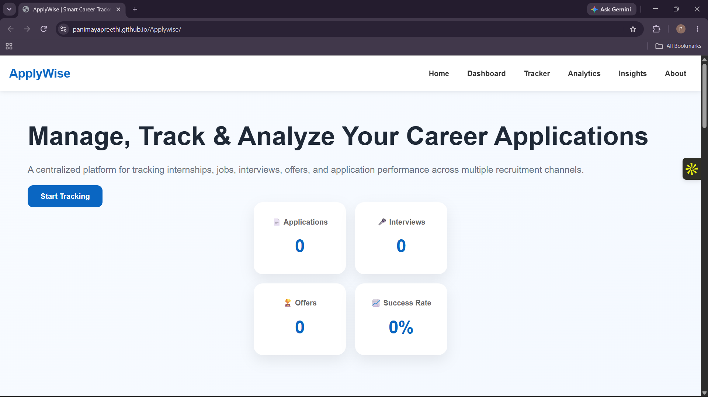
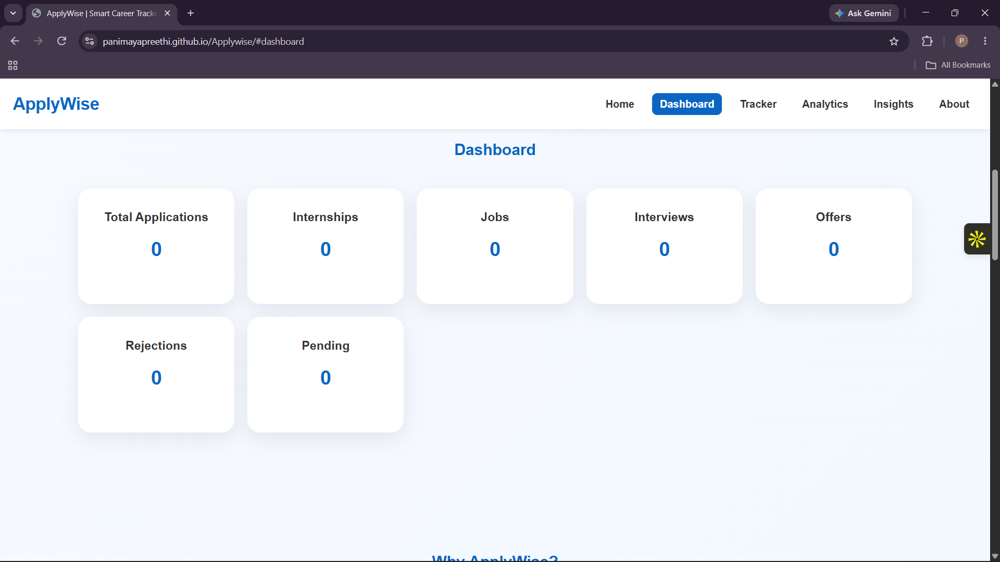
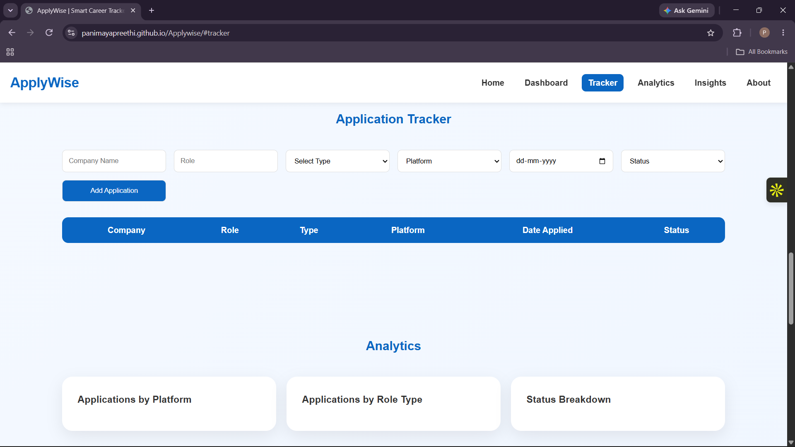
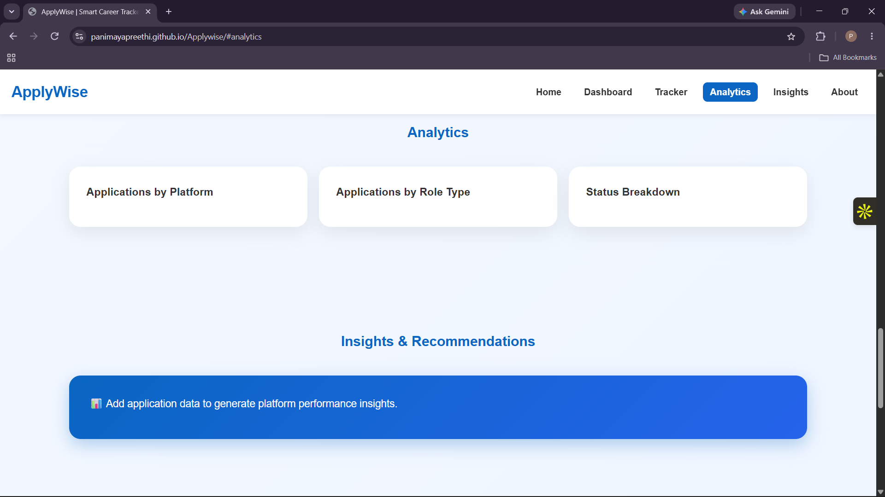
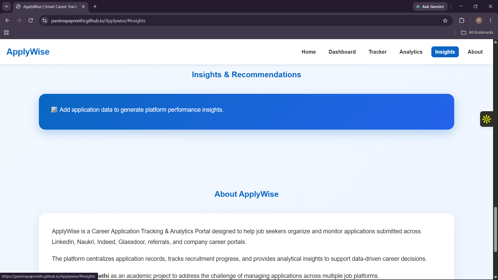
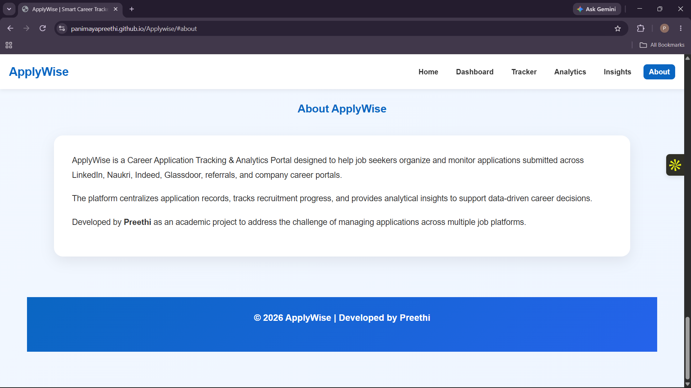

<div align="center">

# 🚀 ApplyWise

### Career Application Tracking & Analytics Portal

A web-based platform designed to help job seekers **track, monitor, analyze, and improve** their job application journey.

<br>

[](https://developer.mozilla.org/en-US/docs/Web/HTML)
[](https://developer.mozilla.org/en-US/docs/Web/CSS)
[](https://developer.mozilla.org/en-US/docs/Web/JavaScript)
[](https://github.com/)

<br>

**📊 Track Applications • 📈 Analyze Performance • 💡 Get Insights**

</div>

---

## 📌 About the Project

**ApplyWise** is a Career Application Tracking & Analytics Portal built to make the job-search process more **organized, measurable, and data-driven**.

Instead of managing applications across spreadsheets, notes, and different platforms, ApplyWise provides a centralized interface where users can:

* 📝 Track job applications
* 📊 Monitor important metrics
* 📈 Analyze application activity
* 💡 View insights and recommendations
* 🎯 Understand their job-search performance

The project combines **front-end development, analytics, UI/UX design, and data-driven decision making** into one practical application.

---

## 🎯 Objectives

* Track job applications efficiently
* Monitor application progress and statuses
* View important application metrics
* Analyze job-search performance
* Identify patterns and opportunities for improvement
* Provide actionable insights for better application strategies
* Create a simple and user-friendly career management experience

---

## ✨ Key Features

### 📊 Analytics Dashboard

Provides a quick overview of important career-search metrics including:

* Total Applications
* Interviews
* Offers
* Application Activity

### 📝 Application Tracker

Allows users to organize and monitor their job applications along with their current status and progress.

### 📈 Application Analytics

Helps users understand application trends and evaluate their overall job-search performance.

### 💡 Insights & Recommendations

Provides actionable suggestions based on application activity to help users improve their application strategy.

### 🎨 Responsive User Interface

A clean, modern, and responsive interface designed for simple navigation and usability across different screen sizes.

### 🔗 Portfolio Integration

Developed as a practical portfolio project demonstrating skills in:

**Web Development • Analytics • UI Design • Data-Driven Decision Making**

---

## 🖥️ Project Preview

<div align="center">

### 🏠 Homepage



<br><br>

### 📊 Analytics Dashboard



<br><br>

### 📝 Application Tracker



<br><br>

### 📈 Analytics



<br><br>

### 💡 Insights & Recommendations



<br><br>

### ℹ️ About



</div>

---

## 🛠️ Technologies Used

| Technology     | Purpose                                   |
| -------------- | ----------------------------------------- |
| **HTML5**      | Page structure and content                |
| **CSS3**       | Styling, layout, and responsive design    |
| **JavaScript** | Interactivity and application logic       |
| **Git**        | Version control                           |
| **GitHub**     | Repository management and project hosting |

---

## 📂 Project Structure

```text
ApplyWise/
│
├── index.html
├── style.css
├── script.js
│
├── images/
│   ├── Homepage.png
│   ├── Dashboard.png
│   ├── Tracker.png
│   ├── Analytics.png
│   ├── Insights.png
│   └── About.png
│
└── README.md
```

---

## 🚀 How to Run

### 1️⃣ Clone the Repository

```bash
git clone https://github.com/panimayapreethi/ApplyWise.git
```

### 2️⃣ Navigate to the Project

```bash
cd ApplyWise
```

### 3️⃣ Run the Application

Open `index.html` in any modern web browser.

> **No additional installation, dependencies, or setup are required.**

---

## 🧠 What I Learned

Building ApplyWise helped me strengthen my understanding of:

* Front-end web development
* HTML, CSS, and JavaScript
* JavaScript-based interactivity
* Dashboard and UI design
* Data-driven decision making
* User experience design
* Responsive web design
* Git and GitHub project management

---

## 🔮 Future Improvements

Planned improvements for future versions include:

* 🔐 User authentication
* 🗄️ Database integration
* 🔄 Real-time application tracking
* 📊 Advanced analytics
* 🔎 Job search API integration
* ⏰ Automated application reminders
* 🤖 AI-powered career recommendations

---

## 👩‍💻 Author

<div align="center">

### **Panimaya Preethi S**

**MBA | Business & Data Analytics**

Interested in **Data Analytics, Business Analytics, Product Analytics, and Technology.**

<br>

[](https://panimayapreethi.github.io/My-Portfolio/)
[](https://github.com/panimayapreethi)
[](https://www.linkedin.com/in/panimaya-preethi/)

</div>

---

<div align="center">

⭐ **If you find ApplyWise interesting, consider starring the repository!**

**Built with HTML, CSS & JavaScript ❤️**

</div>
